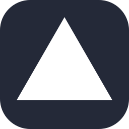
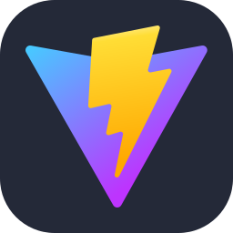
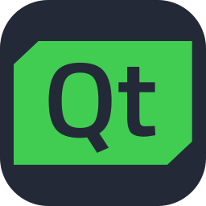
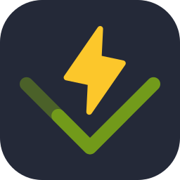

# 💫 About:
🔭 I’m continuously learning about LLMs, AI agents, and scalable AI systems 🤝 I’m open to collaborating on AI-driven products, LLM applications, and intelligent systems 💼 I’m seeking roles in AI product engineering, applied AI, or AI R&D

# 💻 Skills:
                     

# 📊 Stats:

## 💰 Support

## 📫 Connect

  
  
  
  
  

