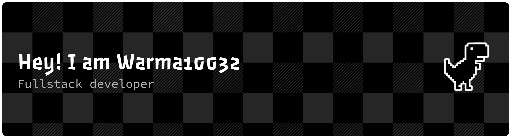

# 💫 About Me:
🔭 I’m continuously learning about LLMs, AI agents, and scalable AI systems 🤝 I’m open to collaborating on AI-driven products, LLM applications, and intelligent systems 💼 I’m seeking roles in AI product engineering, applied AI, or AI R&D

# 💻 Tech Stack:
                       

# 📊 GitHub Stats:

## 📫 Connect

  
  
  
  
  

## 💰 You can help me by Donating
